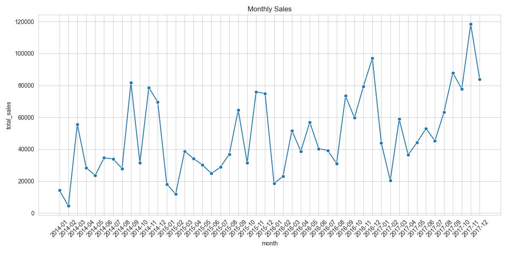
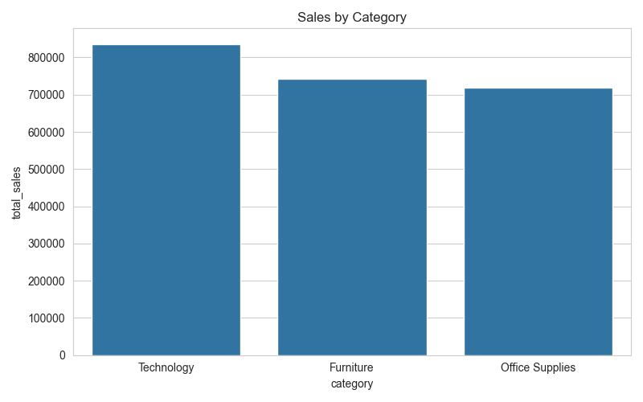
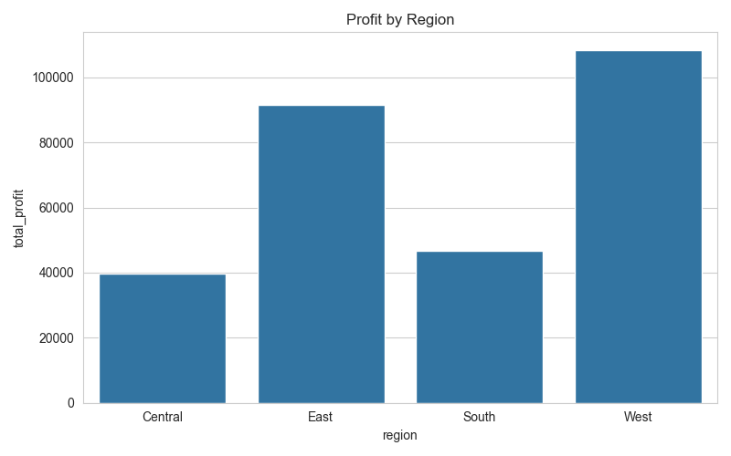
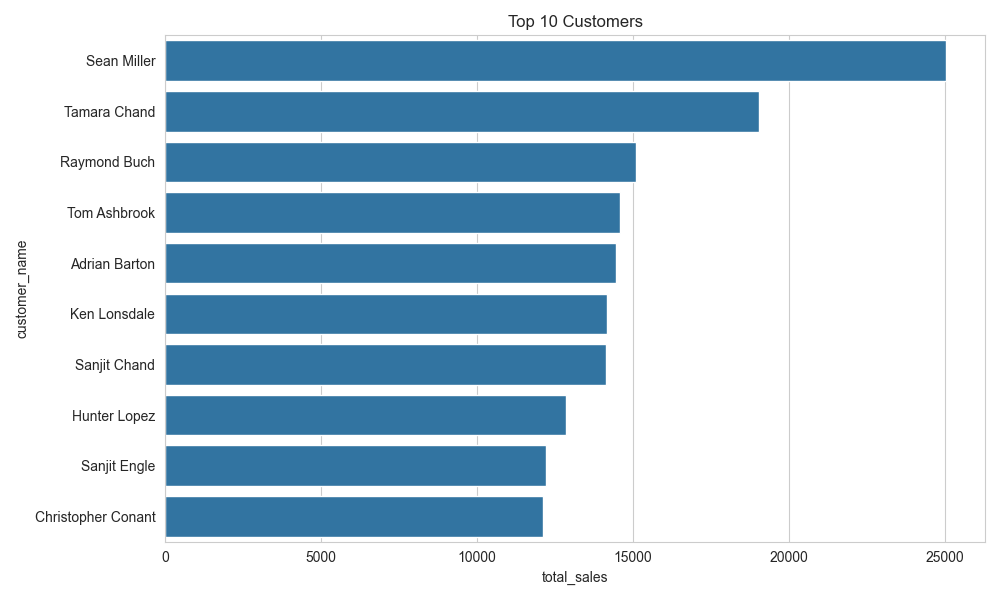
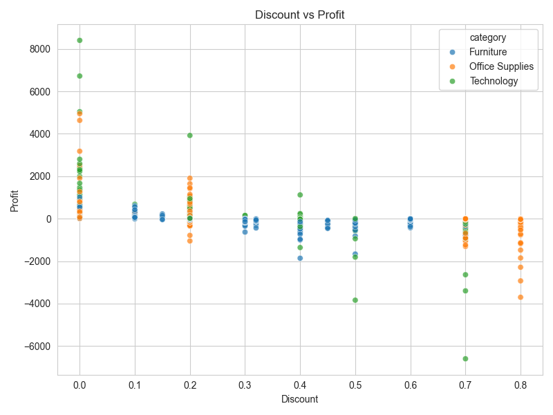
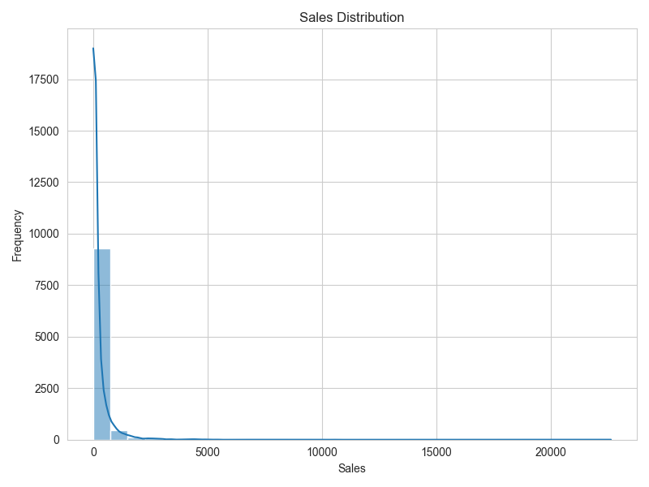

# 📊 Sales ETL Pipeline

A complete ETL (Extract, Transform, Load) pipeline built using **Python**, **Pandas**, **SQLite**, and **SQL**. This project demonstrates the complete data engineering workflow—from raw data ingestion to transformation, validation, database loading, SQL analysis, and data visualization.

---

## 📌 Project Overview

The goal of this project is to build a production-style ETL pipeline that processes retail sales data and stores it in a SQLite database for analysis.

The pipeline performs the following tasks:

* Extracts raw sales data from a CSV file
* Cleans and transforms the data
* Saves the cleaned dataset for downstream use
* Validates data quality before loading
* Loads the transformed data into a SQLite database
* Executes SQL analysis
* Generates visualizations automatically
* Records pipeline execution using logging

---

## 🏗️ ETL Pipeline Architecture

```text
                Raw CSV Dataset
                       │
                       ▼
                 Extract Data
                       │
                       ▼
               Transform Data
                       │
                       ▼
               Validate Data
                       │
          ┌────────────┴────────────┐
          ▼                         ▼
 Save Cleaned CSV            Load into SQLite
(data/processed/)                  │
                                    ▼
                     Generate Visualizations
                                    │
                                    ▼
                         Analysis & Insights
```
---

## 📁 Project Structure

```text
sales-etl-pipeline/
│
├── data/
│    ├── raw/
│    │   └── sales.csv
│    │
│    └── processed/
│        └── cleaned_sales.csv
│
├── database/
│   └── sales.db
│
├── logs/
│   └── pipeline.log
│
├── scripts/
│   ├── config.py
│   ├── logger.py
│   ├── extract.py
│   ├── transform.py
│   ├── validator.py
│   ├── load.py
│   ├── visualize.py
│   └── main.py
│
├── sql/
│   └── queries.sql
│
├── visualizations/
│   ├── monthly_sales.png
│   ├── sales_by_category.png
│   ├── profit_by_region.png
│   ├── top_customers.png
│   ├── discount_vs_profit.png
│   └── sales_distribution.png
│
├── requirements.txt
├── .gitignore
└── README.md
```

---

## ⚙️ Technologies Used

* Python
* Pandas
* SQLAlchemy
* SQLite
* SQL
* Matplotlib
* Seaborn
* Logging
* Git & GitHub

---

## 📂 Dataset

**Dataset:** Sample Superstore Dataset

The dataset contains retail sales information, including:

* Orders
* Customers
* Products
* Sales
* Profit
* Discount
* Region
* Category

---

## 🔄 ETL Workflow

### 1. Extract

* Reads the raw CSV dataset
* Handles file-related exceptions
* Logs extraction status

### 2. Transform

* Renames columns to snake_case
* Converts date columns
* Removes duplicate records
* Creates a `profit_margin` column
* Saves the cleaned dataset to `data/processed/cleaned_sales.csv`

### 3. Validate

* Checks for missing values
* Checks duplicate records
* Detects negative sales
* Detects negative quantities
* Checks empty customer IDs

### 4. Load

* Loads the cleaned dataset into SQLite
* Replaces the existing table if it already exists
* Logs successful loading

### 5. Visualize

Automatically generates:

* Monthly Sales Trend
* Sales by Category
* Profit by Region
* Top 10 Customers
* Discount vs Profit
* Sales Distribution

---

## 📊 SQL Analysis

The project includes SQL queries covering:

* Aggregate Functions
* GROUP BY
* CASE Statements
* Common Table Expressions (CTEs)
* Window Functions
* Ranking Functions
* Subqueries
* Views
* Monthly Sales Analysis
* Business KPI Analysis

---

## 📈 Visualizations

| Monthly Sales | Sales by Category |
|---------------|-------------------|
|  |  |

| Profit by Region | Top 10 Customers |
|------------------|------------------|
|  |  |

| Discount vs Profit | Sales Distribution |
|---------------------|-------------------|
|  |  |

---

### Discount vs Profit


---

### Sales Distribution


---

## 🚀 How to Run

### 1. Clone the repository

```bash
git clone <repository-url>
```

### 2. Install dependencies

```bash
pip install -r requirements.txt
```

### 3. Run the ETL pipeline

```bash
python scripts/main.py
```

Running the pipeline will automatically:

* Extract the raw dataset
* Transform and clean the data
* Save the cleaned dataset to `data/processed/`
* Validate the data
* Load it into SQLite
* Generate visualizations
* Create execution logs

---

## ✨ Features

* Modular ETL pipeline
* Configuration using `config.py`
* Logging support
* Data validation
* SQLite integration
* SQL analytics
* Automatic chart generation
* Processed dataset export
* Clean project structure

---

## 🔮 Future Improvements

* PostgreSQL support
* Docker containerization
* Apache Airflow orchestration
* Automated unit tests
* CI/CD with GitHub Actions
* Cloud database integration
* Data quality reports

---

## 👨‍💻 Author

**Naina Seth**

Data Engineering | Python | SQL | Data Analytics
